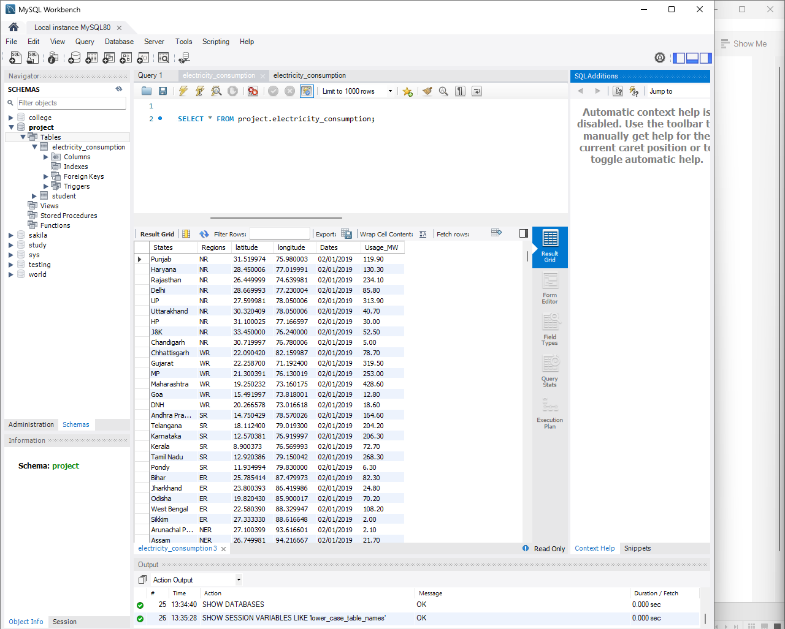
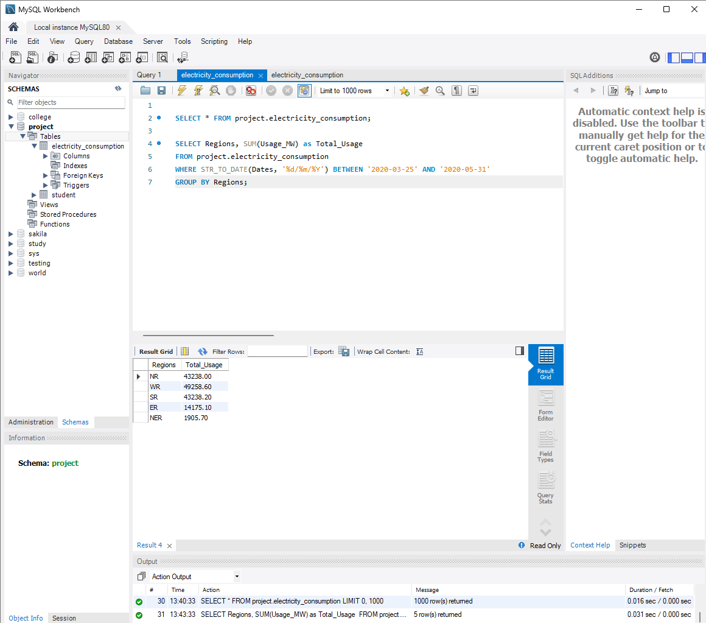

# Plugging into the Future: Electricity Consumption Analysis

This project analyzes electricity consumption across different states and regions in India, with a specific focus on the lockdown period.

## 📊 Tableau Dashboard
You can view the interactive data visualization dashboard here:
👉 **[Click Here to View Tableau Dashboard](https://public.tableau.com/app/profile/rakesh.kumawat/viz/ElectricityConsumptionProject/Story1?publish=yes)**

---

## 💻 MySQL Database & SQL Operations

We have successfully stored the dataset into a MySQL database and performed operations to analyze regional energy usage during the lockdown.

### 🔍 SQL Analysis Output
Below are the screenshots of the data import and the executed analysis query from MySQL Workbench:

### 1. Database Table View

### 2. Regional Lockdown Analysis Output

